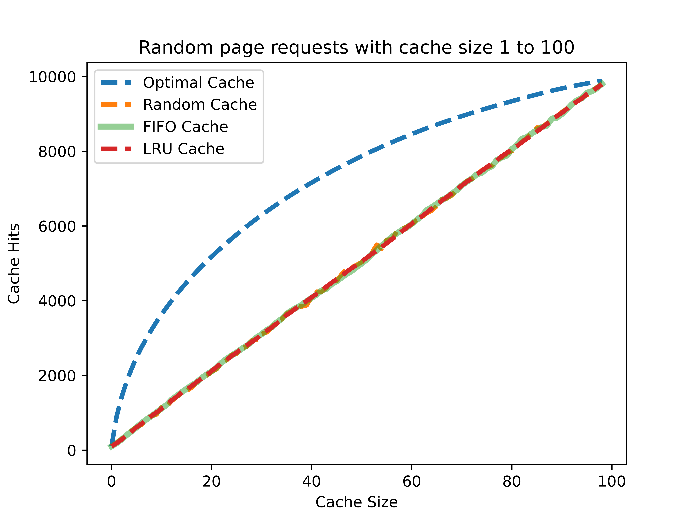
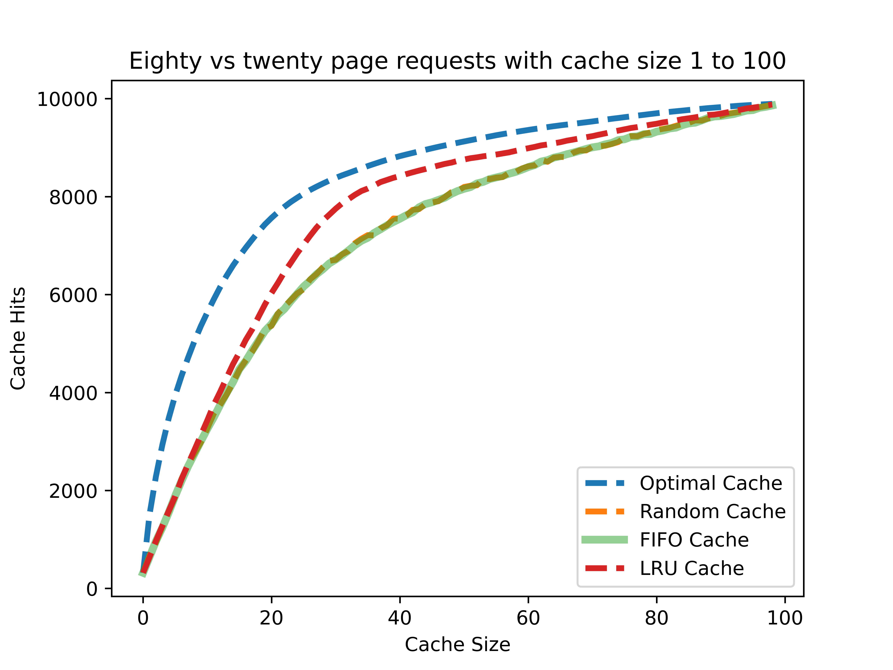
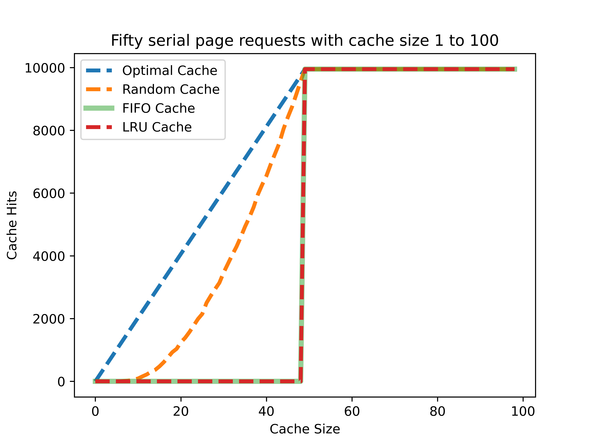

# Comparing Cache Policies Project

This project compare several caching policies with python. 

## Implemented Cache Policies

- Optimal Cache (used [Belady's algorithm](https://ieeexplore.ieee.org/document/5388441), but it unrealistic)
- Random Cache
- FIFO Cache
- LRU(Least-Recently-Used) Cache

## Test Environment 

All tests have a cache that increases in size from 1 to 100. And there are 10000 page requests for each test. 

Here are the page request types:

1. All random 
2. Eighty vs twenty(20% requests for 80% pages, 80% requests for 20% pages)
3. Fifty serial(request serial pages and repeat them. for example, [0, 1, 2, 3, ... , 48, 49, 50, 0, 1, 2, ... and go on])

## Test Results

#### All Random

#### Eighty vs twenty

#### Fifty serial
